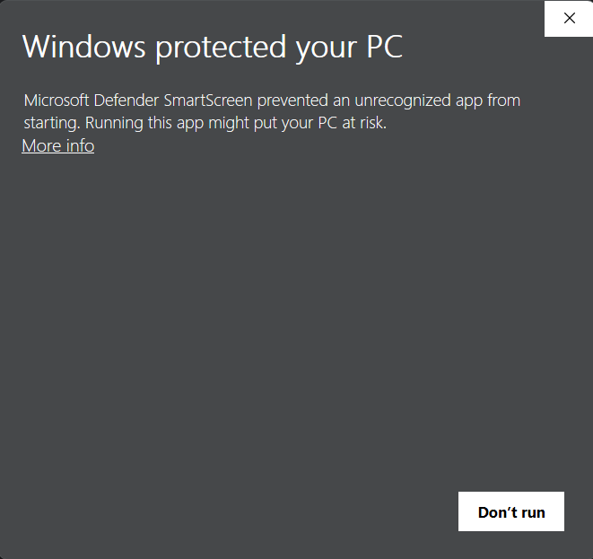
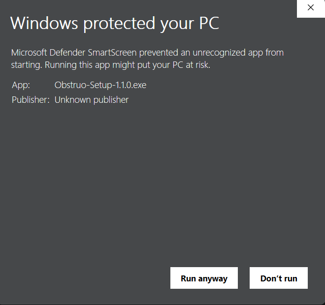

🌐 **Official Website & Download**  
https://darknem4377.github.io/Obstruo-Security/

⬇ **Direct Download (Windows)**  
https://darknem4377.github.io/Obstruo-Security/#download

---

# 🛡️ Obstruo

**Obstruo** is a privacy-first, system-wide website blocking application for Windows, built to help individuals and families protect themselves from harmful online content — without surveillance, tracking, or cloud dependency.

Obstruo operates at the operating system level, applying restrictions across **all browsers and apps**, while keeping full control local to your device.

---

## 🎯 Core Principles

- 🔒 **Privacy-First**  
  No data collection. No telemetry. No tracking.

- 🖥️ **System-Wide Protection**  
  Blocking applies across all browsers and applications.

- 🏠 **Local-Only Control**  
  All rules, logs, and settings stay on your machine.

- 🧠 **Intentional Design**  
  Simple UI. Clear signals. No dark patterns.

---

## ✨ Features (v1.1.0)

- 🚫 System-wide website blocking using a curated blocklist  
- ➕ Manual site blocking with whitelist support  
- 🔐 PIN-protected controls to prevent unauthorized changes  
- 🟢 Session-based protection status and safety indicators  
- ⏸️ Emergency pause with automatic re-enable  
- 🧾 Lightweight local logging with automatic cleanup  
- 🎨 Clean, distraction-free Windows desktop interface  

---

## 🖥️ Platform Support

- ✅ **Windows 10 / 11**
- 🧩 Native desktop application  
- ❌ Not a browser extension

---

## 🛑 Microsoft Defender SmartScreen Notice

Because Obstruo is a **new, unsigned Windows application**, Microsoft Defender SmartScreen will display a warning on first install.

**This is normal and expected behavior for new independent software.**

### How to proceed safely:

When you see this warning:

1. Click **"More info"**

2. Click **"Run anyway"**

3. (Optional) Verify that the installer was downloaded directly from the official website above

**Obstruo contains:**
- ✅ No malware
- ✅ No telemetry  
- ✅ No tracking
- ✅ No background network activity

Code signing will be introduced in a future release once distribution stabilizes.

---

## 🔐 Security & Stability

Obstruo is designed with **safety, resilience, and predictable failure behavior** in mind.

That said, this is an early public release and may still contain bugs or edge cases.  

If you encounter crashes, unexpected behavior, or security concerns, please report them via **GitHub Issues**.

---

## 📜 License

Obstruo is **proprietary software**.

- 🔒 Source code is not open-source  
- 🚫 Redistribution, modification, or reverse-engineering is not permitted  
- 📄 See `LICENSE.txt` for full terms  

---

## ⚠️ Disclaimer

Obstruo is provided **"as is"**, without warranty of any kind.

It is intended as a **protective and supportive tool**, not a replacement for parental supervision, education, or personal responsibility.

---

## 🚧 Project Status

Obstruo **v1.1.0 is released** and under active development.

Future versions may include expanded protection modes, additional controls, performance improvements, and UI refinements.
