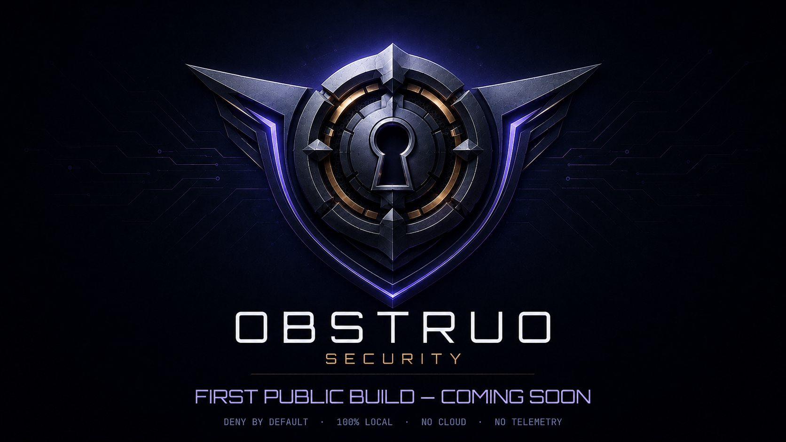

# 🛡️ Obstruo

> ## 🚧 Project Notice
>
> Obstruo is being rebuilt from the ground up, and the official website is
> offline while that happens.
>
> **There are currently no downloads.** Older builds have been withdrawn and
> should not be used — the next public release will be the new architecture.
>
> There is **no estimated release date** at this time. Development is active,
> and downloads will return here and on the new website once the rebuild is
> ready.
>
> Thank you for your patience and support.

---

## Privacy-First Protection for Windows

**Obstruo** is a privacy-first content filter for Windows, built for
individuals and families who want protection from harmful online content
without telemetry, tracking, accounts, or cloud dependency. Everything runs
and stays on your own machine.

Unlike a browser extension, Obstruo filters at the **DNS layer** of the
operating system, so it covers every browser and desktop application that
resolves domain names — not just one browser.

### What the new version does

* **System-wide DNS filtering** — blocked domains simply fail to resolve, in
  every app.
* **Bypass resistance** — encrypted-DNS escape routes (DoH/DoT) are blocked
  and browser DoH is disabled by policy; DNS settings are re-pinned
  automatically if changed.
* **Fail-closed by design** — if the filter can't run, name resolution fails
  rather than silently falling back to an unfiltered connection.
* **Encrypted local data** — credentials, blocklists, and history live in an
  encrypted database on the device. Nothing leaves the machine.
* **PIN/password-protected control** — pausing, allow-listing, settings, and
  uninstall all require the administrator's credential, with lockout
  protection against guessing.
* **Honest about its limits** — DNS filtering is a strong first layer, not a
  guarantee. What it can and cannot catch is documented plainly in
  [docs/FILTERING-LIMITATIONS.md](docs/FILTERING-LIMITATIONS.md).

### Documentation

* [Security policy](SECURITY.md) — scope, guarantees, and how to report a
  vulnerability.
* [Filtering limitations](docs/FILTERING-LIMITATIONS.md) — the threat model
  and the honest boundaries of DNS-layer filtering.
* [Recovery](docs/RECOVERY.md) — credential recovery and last-resort removal.
* [Privacy policy](docs/PRIVACY-POLICY.md) *(draft)* — what data exists, where
  it lives, and what (nothing) leaves your device.
* [End User License Agreement](docs/EULA.md) *(draft)* — the terms shown at
  install time.

## 🚧 Project Status

**Current version: v1.0 (in development, not yet released).**

Current priorities:

* Finishing and hardening the new application architecture
* Rebuilding the official website and distribution
* Refining the dashboard and setup experience
* Expanding blocklist management and feed syncing
* Code signing for public distribution

## 📄 License

Obstruo is proprietary software — see [LICENSE.txt](LICENSE.txt).

© 2026 DarkNem4377. All rights reserved.
